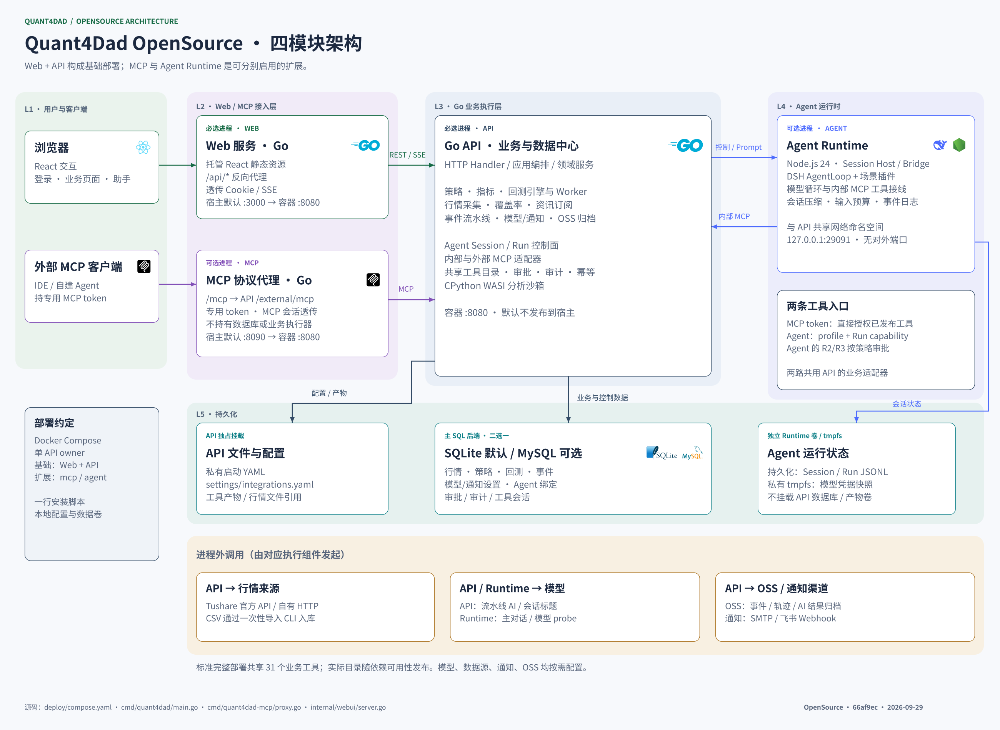
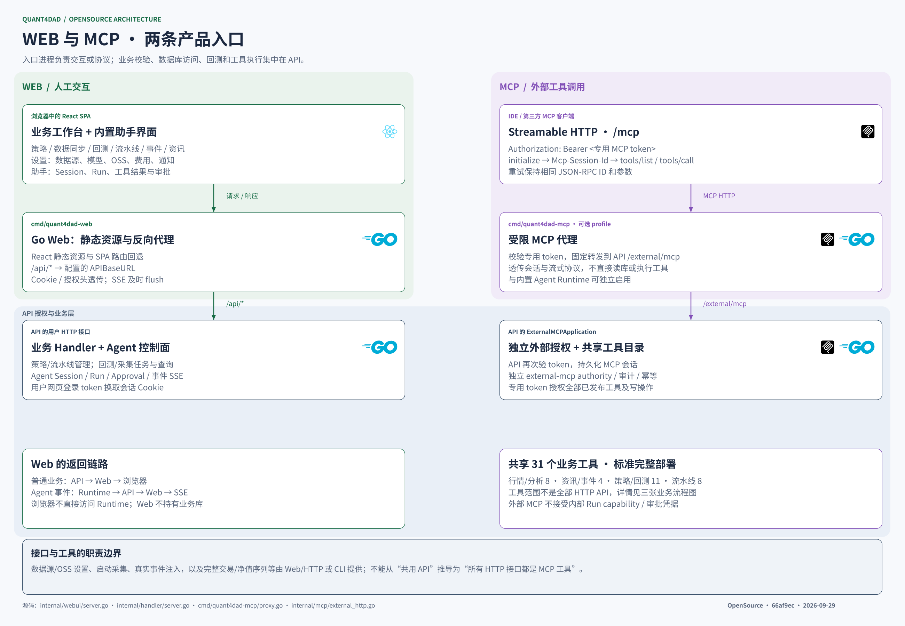
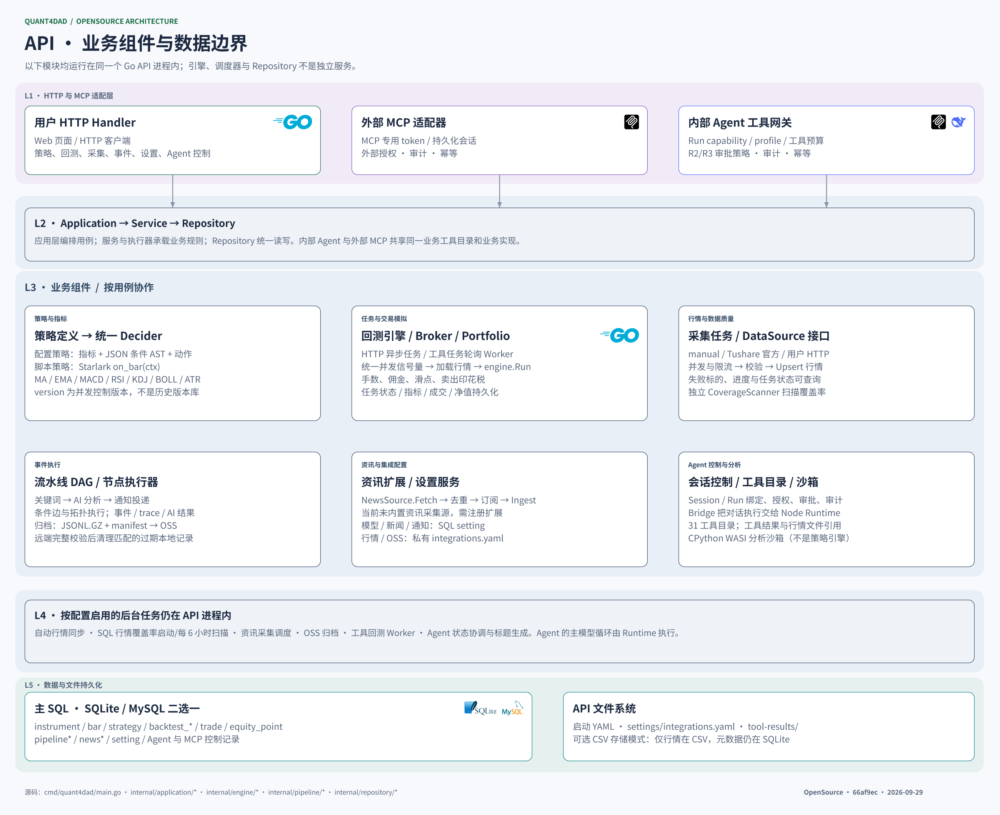
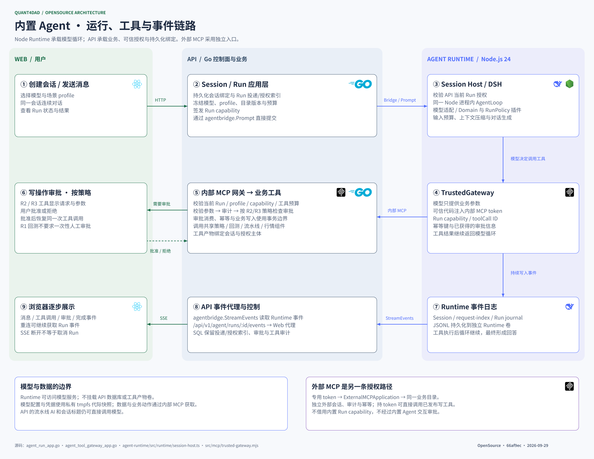
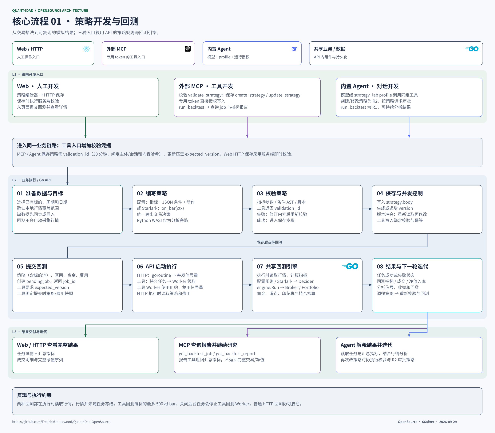
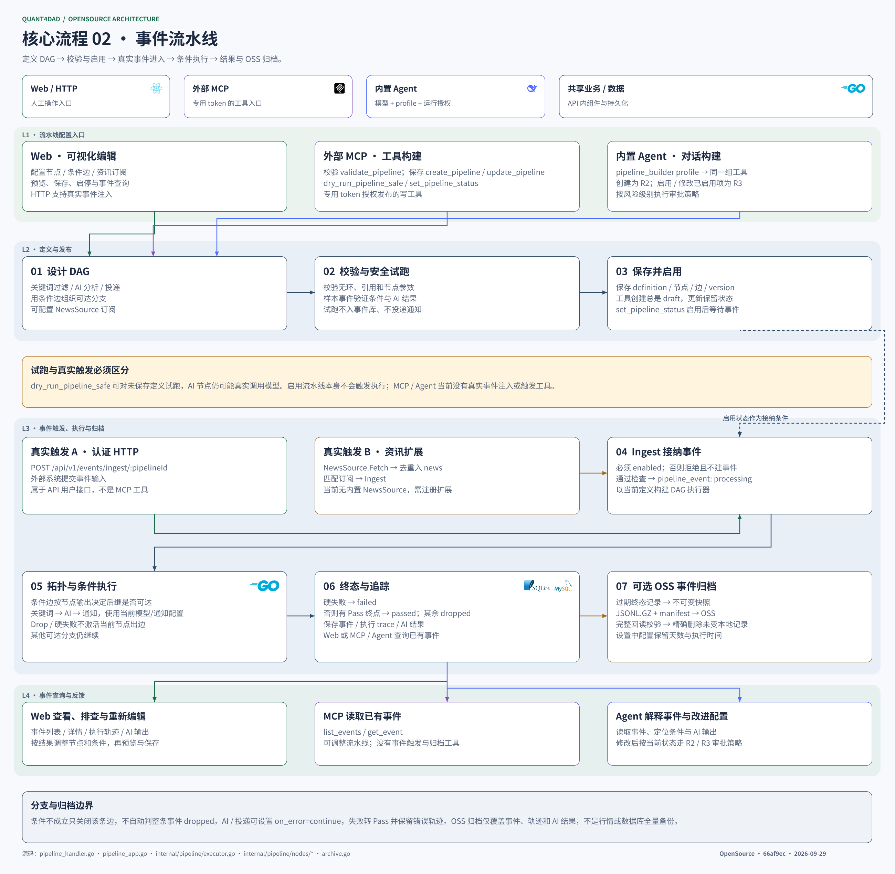
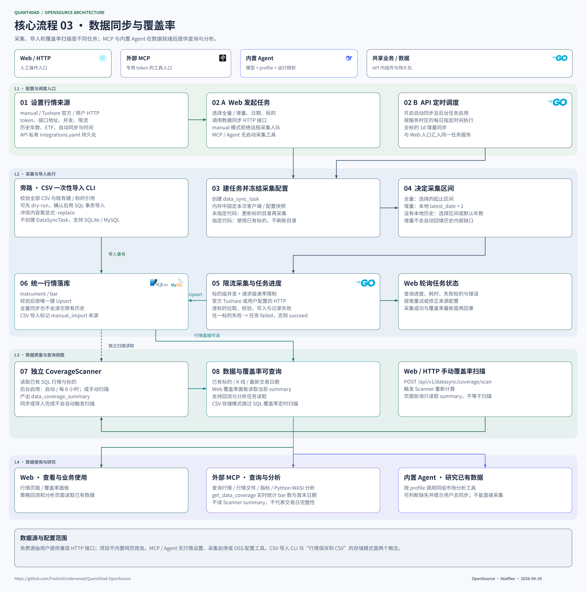

# Quant4Dad Open Source

**Docker Hub：** [API](https://hub.docker.com/r/fredrick19/quant4dad-opensource-api) · [Web](https://hub.docker.com/r/fredrick19/quant4dad-opensource-web) · [MCP](https://hub.docker.com/r/fredrick19/quant4dad-opensource-mcp) · [Agent](https://hub.docker.com/r/fredrick19/quant4dad-opensource-agent)

**GitHub：** [Release 安装包](https://github.com/FredrickUnderwood/Quant4Dad-OpenSource/releases/latest) · [Packages 镜像](https://github.com/FredrickUnderwood/Quant4Dad-OpenSource/packages)

**Git：** [源码仓库](https://github.com/FredrickUnderwood/Quant4Dad-OpenSource) · [ZIP 下载](https://github.com/FredrickUnderwood/Quant4Dad-OpenSource/archive/refs/heads/master.zip)

本地量化研究工作台：行情分析、策略回测、事件流水线，可选 MCP 与 AI 助手。默认 SQLite；数据接入支持 Tushare、自有 HTTP 接口和 CSV，不含网站爬虫。

## 安装

准备 Docker、Compose ≥ 2.20 和 Bash。镜像方式另需 curl，源码方式另需 Git。

**Docker Hub（预构建镜像，amd64 / arm64）**

```bash
curl -fsSL https://raw.githubusercontent.com/FredrickUnderwood/Quant4Dad-OpenSource/master/scripts/download.sh -o /tmp/quant4dad-install.sh && bash /tmp/quant4dad-install.sh
```

仅下载部署文件到 `./quant4dad`，从 Docker Hub 拉取镜像，无需 Git 或编译环境。

**Git（下载源码并构建）**

```bash
git clone https://github.com/FredrickUnderwood/Quant4Dad-OpenSource.git && cd Quant4Dad-OpenSource && ./scripts/install.sh
```

打开 [http://127.0.0.1:3000](http://127.0.0.1:3000)；安装目录内的登录 token：`data/standalone/config/login-token`。命令末尾添加 `--with-mcp` / `--with-agent` 可启用扩展。数据源、模型和通知在「设置」中配置。

MCP 默认 `http://127.0.0.1:8090/mcp`，使用 `data/standalone/config/mcp-token`；该凭据包含写工具权限。配置、凭据及 SQLite 数据保存在 `data/standalone`，升级前备份。

## 架构



<details>
<summary>展开其余六张架构与业务流程图</summary>








</details>

[架构详解与图源](docs/architecture/architecture.md) · [部署与升级](docs/deployment.md) · [用户设置](docs/settings.md) · [数据接入](docs/data-provider.md) · [CSV 导入](docs/data-import.md)

[MIT License](LICENSE) · [Python WASI 许可](third_party/python-wasi/LICENSE.txt) · [图标许可](docs/licenses/lobe-icons-LICENSE.txt)
